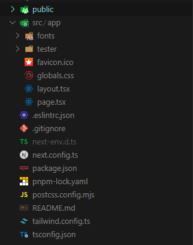

# Como funciona um projeto em JavaScript

Esse guia é um resumo de como funciona um projeto em JavaScript, mais especificamente usando o framework `Next.js`. Algumas coisas serão mais específicas para o Next.js, mas o foco é dar noções de como funciona um projeto em JavaScript.

## O que é o Next.js?

Next.js é um framework React. Escolhemos usar ele porque ele é popular, tem uma comunidade ativa e tem features que serão úteis para o projeto, como [SSG](https://nextjs.org/docs/app/building-your-application/rendering/server-components#static-rendering-default) (Static Site Generation) que nos permite criar páginas estáticas que não precisam de um servidor, assim reduzindo eventuais custos com o Next.js. E caso se torne necessário um servidor, ele também nos permite criar [SSR](https://nextjs.org/docs/app/building-your-application/rendering/server-components#dynamic-rendering) (Server-Side Rendering).

## Estrutura de arquivos e pastas

- public/
- src/
  - app/
    - page.tsx
    - layout.tsx
    - sample-page/
      - page.tsx
- package.json
- tsconfig.json
- next.config.js
- package-lock.json / pnpm-lock.yaml
- .gitignore
- .env
- README.md
- .eslintrc.json
- postcss.config.js
- tailwind.config.js

### [app/](https://nextjs.org/docs/app/building-your-application/routing#the-app-router)

Esse é o diretório e página inicial do Next.js. A pagina "sobre nós", por exemplo, ficaria em `app/about/page.tsx`.

### [page.tsx](https://nextjs.org/docs/app/building-your-application/routing/pages)

O arquivo `page.tsx` é onde fica o componente da página em questão. Já que estamos dentro da pasta `app/`, e ela é a raiz, então, `app/page.tsx` é o arquivo que representa a página inicial. Igualmente com a pagina `/sample-page`, que ficaria em `app/sample-page/page.tsx`.

### [layout.tsx](https://nextjs.org/docs/app/building-your-application/routing/layouts-and-templates#layouts)

O arquivo `layout.tsx` é um componente que envolve a página inteira, e pode ser usado para compartilhar informações entre as páginas, como um header, footer, etc. Todas as páginas filhas herdam os elementos desse componente.

### [package.json](https://docs.npmjs.com/cli/v10/configuring-npm/package-json)

O arquivo `package.json` é o arquivo de configuração do projeto ou, mais especificamente, do NPM. Ele contém informações sobre o projeto, como o nome, versão, dependências, scripts, etc. Parecido com o `composer.json` do PHP ou o `requirements.txt` do Python.

### [tsconfig.json](https://www.typescriptlang.org/docs/handbook/tsconfig-json.html)

O arquivo `tsconfig.json` é o arquivo de configuração do TypeScript.

### [next.config.js](https://nextjs.org/docs/app/api-reference/next-config-js)

O arquivo `next.config.js` é o arquivo de configuração do Next.js. Ele contém configurações globais para o projeto, como o modo de build, o servidor, como o site deve ser publicado, etc.

## Links Úteis

- [Learn Next.js](https://nextjs.org/learn)
- [Next.js](https://nextjs.org/)
- [Tailwind CSS](https://tailwindcss.com/)
