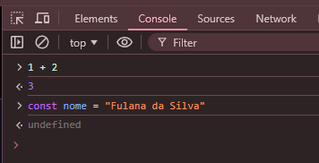
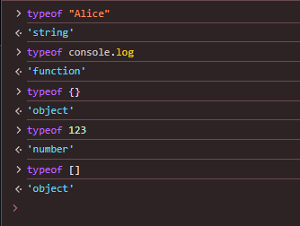

# Aprendendo JavaScript

Antes de começar, é importante saber que toda documentação oficial do JavaScript fica no site [MDN Web Docs](https://developer.mozilla.org/pt-BR/docs/Web/JavaScript) e a chave para aprender qualquer coisa é ler a documentação oficial da coisa que você quer aprender. Todo guia ou tutorial que você encontrar na internet é uma tentativa de explicar a documentação oficial em um formato mais fácil de entender para as pessoas.

O Objetivo desse guia é ser um guia para aprender JavaScript e não um guia para aprender programação.

> [!IMPORTANT]
> O site existe em português, mas a documentação oficial é em inglês. Usaremos a versão em inglês por ser mais completa e atualizada.

## Rodando JavaScript

O jeito mais fácil de rodar JavaScript é apertando F12 no seu navegador, acessando a aba "Console" e escrevendo seu código.



```js
console.log("Olá, mundo!");
```

Outro jeito é usar o [Node.js](#nodejs), que é um ambiente de execução de JavaScript que roda no Servidor.

> [!NOTE]
> `console.log` é uma função que imprime uma mensagem no console do navegador.

## [Variáveis e Tipos de Dados](https://developer.mozilla.org/pt-BR/docs/Web/JavaScript/Data_structures)

### Declaração de Variáveis

As palavras-chave `let`, `const` ou `var` são usadas para declarar variáveis. `var` é a forma antiga de declarar variáveis, `let` e `const` são a forma moderna. `const` é usado para declarar constantes e `let` para declarar variáveis. Por via de regra, **sempre** use `const` e em casos específicos use `let`.

```js
const idade = 20;
let nome = "Alicx";

// Isso é válido
nome = "Alice";

// Isso não é válido e vai dar o erro:
// Uncaught TypeError: Assignment to constant variable.
idade = 21;
```

### Tipos de Dados

No JavaScript existem alguns tipos de dados, uns são primitivos e outros são compostos:

- [undefined](https://developer.mozilla.org/en-US/docs/Web/JavaScript/Data_structures#undefined_type)
- [null](https://developer.mozilla.org/en-US/docs/Web/JavaScript/Data_structures#null_type)
- [boolean](https://developer.mozilla.org/en-US/docs/Web/JavaScript/Data_structures#boolean_type)
- [string](https://developer.mozilla.org/en-US/docs/Web/JavaScript/Data_structures#string_type)
- [number](https://developer.mozilla.org/en-US/docs/Web/JavaScript/Data_structures#number_type)
- [object](https://developer.mozilla.org/en-US/docs/Web/JavaScript/Data_structures#object_type)
- [symbol](https://developer.mozilla.org/en-US/docs/Web/JavaScript/Data_structures#symbol_type)
- [bigint](https://developer.mozilla.org/en-US/docs/Web/JavaScript/Data_structures#bigint_type)
- [function](https://developer.mozilla.org/en-US/docs/Web/JavaScript/Guide/Functions)

Para checar o tipo de um dado, use a função `typeof`.



> [!NOTE]
> Dica da mamãe, não precisa aprender tudo de uma vez, aprenda quando precisar da coisa específica. Só lembre que os tipos existem e quando precisar de algum, aí sim vá ler a documentação oficial.

#### Funções

As funções são parecidas com formulas matemáticas. Você passa 0 ou mais valores para a função e ela retorna um valor. Ou uma forma de bolo, você passa os ingredientes e ela retorna o bolo pronto.

```js
// "Declaração de função"
function soma(a, b) {
  return a + b;
}

// "Expressão de função"
const bolo = function () {
  return "🎂";
};

const boloMorango = () => {
  return "🍓🎂";
};

const boloChocolate = () => "🍫🎂";

const boloCustom = (sabor) => sabor + "🎂";

soma(1, 2); // 3
bolo(); // 🎂
boloChocolate(); // 🍫🎂
boloMorango(); // 🍓🎂
boloCustom("🍉"); // 🍉🎂
```

> [!NOTE]
> Se quiser saber a diferença entre declaração e expressão de função, procure `js function declaration vs function expression` no Google.

#### Arrays

```js
const lista = [1, 2, 3];

lista.push(4); // [1, 2, 3, 4]
lista.pop(); // [1, 2, 3]

lista[0]; // 1
lista[1]; // 2
lista[2]; // 3

// Desestruturação ou "destructuring"
const [primeiro, segundo, terceiro] = lista;

console.log(primeiro, segundo, terceiro); // 1 2 3
```

#### Objetos

```js
const pessoa = {
  nome: "Alice",
  idade: 20,
};

pessoa.idade; // 20
pessoa.nome; // "Alice"

pessoa.sobrenome = "Silva";

delete pessoa.sobrenome;

// Desestruturação de objetos
const { nome, idade, sobrenome } = pessoa;

console.log(
  pessoa,
  pessoa.nome,
  nome,
  idade,
  sobrenome,
); // { nome: "Alice", idade: 20 } "Alice" 20 undefined
```

## [Loops](https://developer.mozilla.org/en-US/docs/Web/JavaScript/Guide/Loops_and_iteration) e [Controle de Fluxo](https://developer.mozilla.org/en-US/docs/Web/JavaScript/Guide/Control_flow_and_error_handling)

### Condicionais

```js
const idade = 17;

if (idade >= 18) {
  console.log("Você é maior de idade");
} else {
  console.log("Você é menor de idade");
}

// Ternário
const maiorDeIdade = idade >= 18 ? "Você é maior de idade" : "Você é menor de idade";

console.log(maiorDeIdade); // Você é menor de idade
```

### Loops

```js
// for loop
for (let i = 0; i < 10; i++) {
  console.log(i);
}

const lista = [1, 2, 3];

// list loop
for (let i = 0; i < lista.length; i++) {
  console.log(lista[i]);
}

// "for-of" loop
for (const item of lista) {
  console.log(item);
}

// "forEach" loop
lista.forEach((item) => {
  console.log(item);
});

// "map" loop
const listaAoQuadrado = lista.map((item) => item ** 2);

console.log(listaAoQuadrado); // [1, 4, 9]
```

> [!NOTE]
> `for` é considerado um estilo imperativo, você diz como fazer.
> `forEach` e `map` são considerados estilos declarativos ou funcionais, você diz o que fazer.
> Programação funcional é muito melhor :3 ~~talvez seja mais difícil de aprender~~.

## Node.js

No Node.js, a forma de escrever é a mesma, ainda é JavaScript. A diferença é que o Node roda no servidor e não no navegador. Então, tudo que você pode fazer no navegador, não vai funcionar no Node. Por exemplo, coisas envolvendo o [DOM](https://developer.mozilla.org/en-US/docs/Web/API/Document_Object_Model) como `document.querySelector` não vai funcionar.

O Node.js tem suas próprias funções, como por exemplo, acessar o sistema de arquivos, criar servidores, etc. Sua documentação oficial fica no site [Node.js](https://nodejs.org/en/docs).

## Links Úteis

- [Declarative vs Imperative Programming](https://dev.to/ruizb/declarative-vs-imperative-4a7l)
- [Modern JS Cheatsheet](https://github.com/mbeaudru/modern-js-cheatsheet)
- [Node.js](https://nodejs.org)
- [MDN Web Docs](https://developer.mozilla.org/en-US/docs/Web/JavaScript)
- [JavaScript.info](https://javascript.info)
- [Node Installation](https://nodejs.org/en/learn/getting-started/how-to-install-nodejs)
